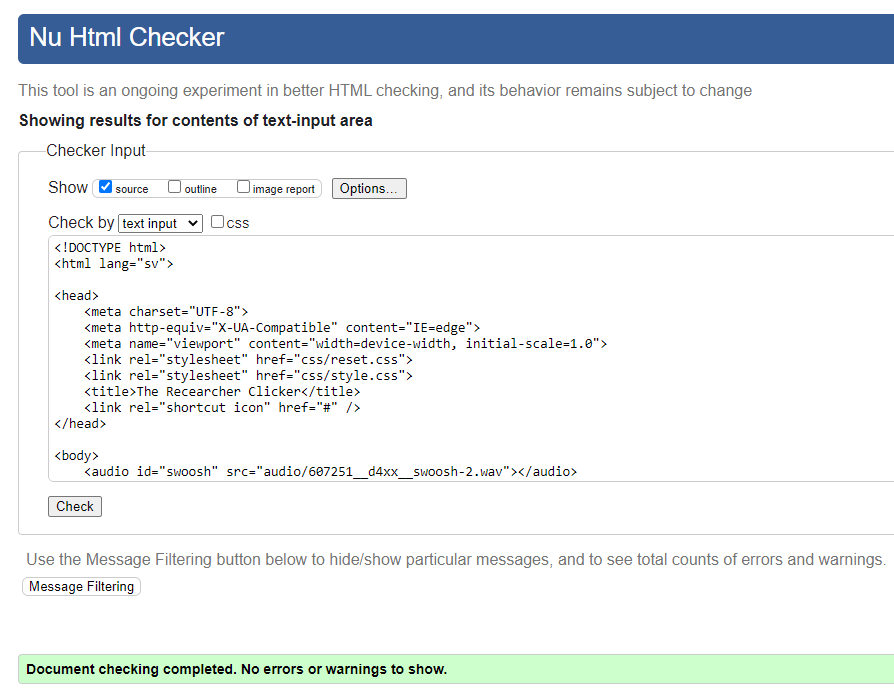

# Clicker

Fabian Sigfridsson
2023-06-07

## Inledning

Jag skulle utveckla en clicker från en existerande 
kod både i design och funktion.
Jag skulle sedan Wave:a och validera hemsidan.

## Bakgrund

Jag började med att planera vad clickern skulle handla om.
Sedan började jag med att läsa igenom koden för att se och förstå hur den 
fungerar och var jag ska ändra på den.
Efter det så började jag med att skriva om i javascript filen så att jag fick alla
funktioner som jag ville att clickern skulle ha.
Efter det så letade jag upp bilder som jag fick använda gratis. Då var det bara att 
byta ut bilderna i html dokumentet. Nu så var det bara kvar att [Wave](https://chrome.google.com/webstore/detail/wave-evaluation-tool/jbbplnpkjmmeebjpijfedlgcdilocofh):a 
och validera sidan. För att validera sidan så använde jag [validator.nu](https://validator.nu/). Efter att jag fixat problemen som Wave och validator.nu klagade på så var jag färdig med clickern.

## Positiva erfarenheter

Det har gått bra att skriva javascript och jag tror att det bror på att jag har lite
förkunskaper och att jag är väldigt motiverad att lära mig mer.

## Negativa erfarenheter

Det som jag hade mest problem med var att Wave:a hemsidan för att den alltid klagade på kontrast
problem med min header. Det visade sig att jag hade glömt att ge bilden en 
bakgrund och att det var det Wave klagade på, så nu vet jag att jag alltid ska ge bilder en bakgrund
så att om bilden inte skulle finnas så kommer materialet ovanpå bilden alltid ha kontrast.
Annars så är mitt största problem att skriva dokumentation och att försöka göra små
commits.

## Sammanfattning

Jag skulle generellt sett säga att själva html och javascript koden gick ganska bra
men att jag hade lite problem med att förstå vad det var som Wave ville att jag skulle
ändra på och mycket problem med dokumentation.
Om man skulle fortsätta utveckla clickern så skulle man kunna göra en bättre bakgrund 
till själva clickern och fixa lite overflow problem på knappen. Man skulle också
kunna lägga till mer uppgraderingar och fler planeter som man kan fara till efter rebirth.